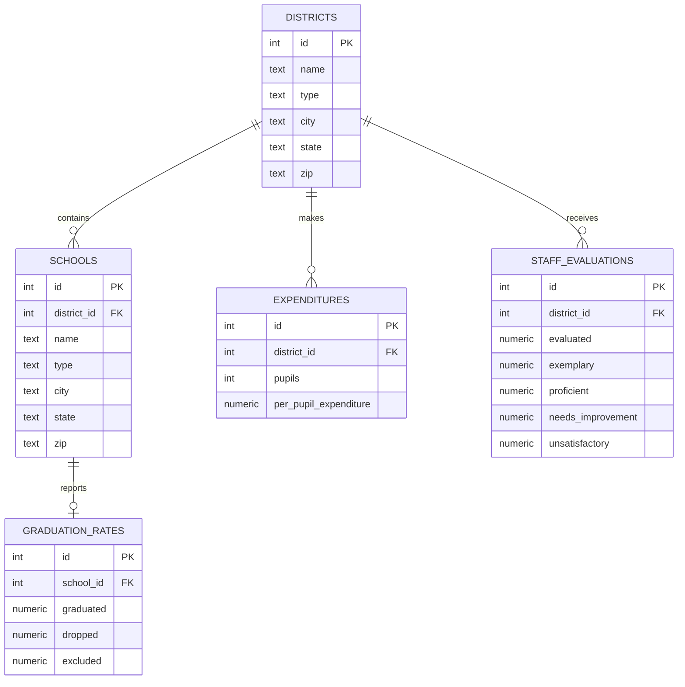

```mermaid
erDiagram
    DISTRICTS ||--o{ SCHOOLS : "contains"
    SCHOOLS ||--o| GRADUATION_RATES : "reports"
    DISTRICTS ||--o{ EXPENDITURES : "makes"
    DISTRICTS ||--o{ STAFF_EVALUATIONS : "receives"
    
    
    
    
    DISTRICTS {
        int id PK
        text name
        text type
        text city
        text state
        text zip
    }
    SCHOOLS {
        int id PK
        int district_id FK
        text name
        text type
        text city
        text state
        text zip
    }
    GRADUATION_RATES {
        int id PK
        int school_id FK
        numeric graduated
        numeric dropped
        numeric excluded
    }
    EXPENDITURES {
        int id PK
        int district_id FK
        int pupils
        numeric per_pupil_expenditure
    }
    STAFF_EVALUATIONS {
        int id PK
        int district_id FK
        numeric evaluated
        numeric exemplary
        numeric proficient
        numeric needs_improvement
        numeric unsatisfactory
    }
```
