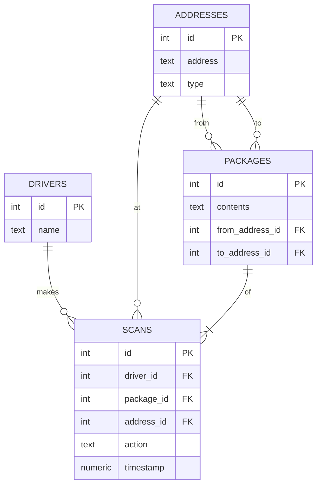

```mermaid
erDiagram
    DRIVERS ||--o{ SCANS : "makes"
    ADDRESSES ||--o{ SCANS : "at"
    PACKAGES ||--|{ SCANS : "of"
    ADDRESSES ||--o{ PACKAGES : "from"
    ADDRESSES ||--o{ PACKAGES : "to"
    
    
    
    
    ADDRESSES {
        int id PK
        text address
        text type
    }
    PACKAGES {
        int id PK
        text contents
        int from_address_id FK
        int to_address_id FK
    }
    DRIVERS {
        int id PK
        text name
    }
    SCANS {
        int id PK
        int driver_id FK
        int package_id FK
        int address_id FK
        text action
        numeric timestamp
    }
```
