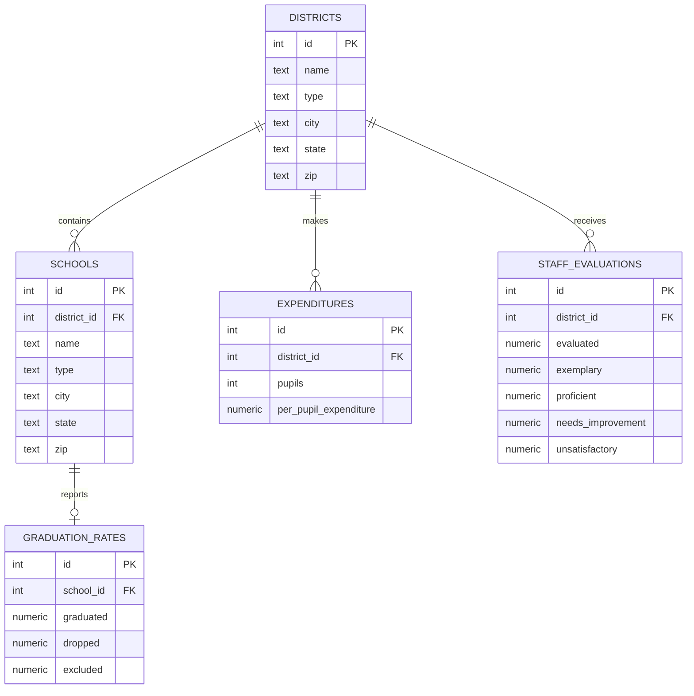

# Mermaid Chart

**About Mermaid Chart:**

Mermaid Chart is a tool that allows you to create flowcharts and diagrams using a simple markdown-like language. It is a great tool for creating visual representations of data and processes. You can use Mermaid Chart to create flowcharts, sequence diagrams, Gantt charts, and more. Mermaid Chart is easy to use and produces professional-looking results. You can use Mermaid Chart to create diagrams for presentations, reports, and other documents. Mermaid Chart is a powerful tool that can help you communicate complex ideas in a clear and concise way. (AI generated content)

**How I use Mermaid Chart:**

I use Mermaid Chart to create ER diagrams for the databases. We work with in the CIT 28 class. I find it a beneficial to a visual representation of the database schema, to reference while working on problem sets. While you can find similar diagrams on the CS50 website, I find it helpful to have a more detailed diagram that I can reference while working on the problem sets.

**Example of a Mermaid Chart Diagram:**

## Creating an ERD

**How I create an ERD:** 
- After opening a database using the `sqlite3` command, I use the `.output` command to send the output to a file.
- I then use the `.schema` command to get the schema of the database.
- Once I have the file with the schema, I copy the contents of the file and paste it into the [Mermaid Chart AI diagram tool](https://www.mermaidchart.com/app/login?redirect=%2Fapp%2Fprojects%2Fe8e8ec0a-78b2-4849-b018-1b2f44813a5b%2Fdiagrams%2F569bd01c-570d-4b1e-a53b-bdb9f9604716%2Fversion%2Fv0.1%2Fai). This tool, once you have an account, will automatically generate a diagram, and save it to your dashboard, based on the schema you provide. The free account limits you to 5 diagrams, but you can delete old diagrams to make room for new ones.
- I also have used another method by running a `bash` [script]() I created that creates an ERD using a supplied schema file. The script uses [fabric](https://github.com/danielmiessler/fabric) and [ollama](https://ollama.com), to create the ERD, either on locally hosted or remote AI.

**Notes About the Script:**

    A note about using the script. I have gotten the best results using the remote AI. The locally hosted AI has not worked as well for me. Most likely due to small parameters sizes, of the models on my sytem. I have used `llama3` 7b, `llama3.1` 7b, and `gemma2` 9b. They all give me the wrong type of diagram. On the remote AI side I have used `gemini 1.5 pro` the most, and have gotten good results, on par with the Mermaid Chart AI. I have ran out my free api request credits on OpenAI, and Anthropic and have not been able to test the results on these platforms. But, I would expect similar or better results to the remote AI.

**How I use the ERD:**
There are two plugins for VS Code that I use to view the ERD. The first is [Mermaid Chart](https://marketplace.visualstudio.com/items?itemName=MermaidChart.vscode-mermaid-chart). This gives you direct access to your Mermaid Chart diagrams in VS Code. The second is [Markdown Preview Mermaid Support](https://marketplace.visualstudio.com/items?itemName=bierner.markdown-mermaid). This allows you to view the Mermaid Chart diagrams in the markdown preview. I would consider the second plugin to be the most useful, as it allows you to view the rendered diagram in the markdown preview. The first allows to enter a link to the diagram, which you can click to view or edit the diagram in the Mermaid Chart editor. But, that link is not visible in the markdown preview, or github. I prefer the second plugin, because embedding the diagram directly in the markdown file allows me to view the diagram in the markdown preview, and on github.