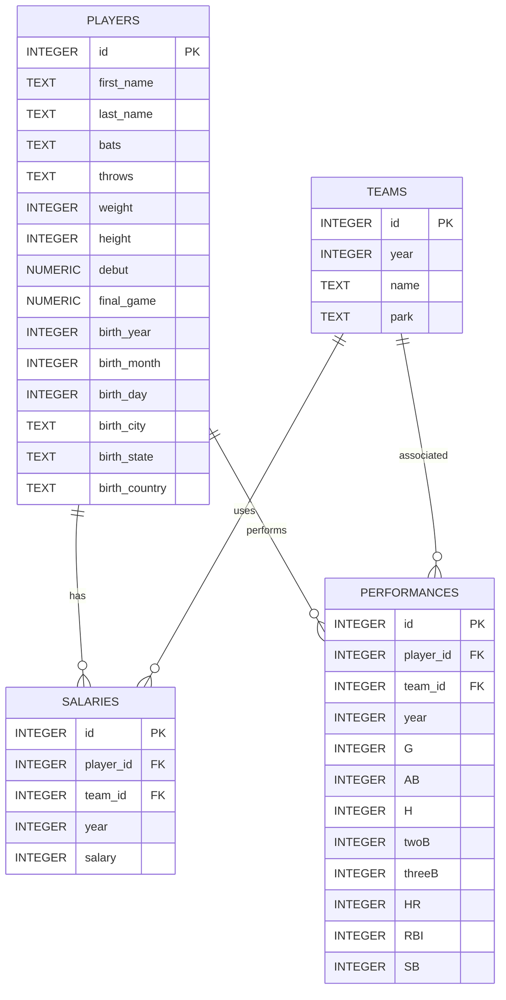

```mermaid
erDiagram
    PLAYERS {
        INTEGER id PK
        TEXT first_name
        TEXT last_name
        TEXT bats
        TEXT throws
        INTEGER weight
        INTEGER height
        NUMERIC debut
        NUMERIC final_game
        INTEGER birth_year
        INTEGER birth_month
        INTEGER birth_day
        TEXT birth_city
        TEXT birth_state
        TEXT birth_country
    }

    TEAMS {
        INTEGER id PK
        INTEGER year
        TEXT name
        TEXT park
    }

    SALARIES {
        INTEGER id PK
        INTEGER player_id FK
        INTEGER team_id FK
        INTEGER year
        INTEGER salary
    }

    PERFORMANCES {
        INTEGER id PK
        INTEGER player_id FK
        INTEGER team_id FK
        INTEGER year
        INTEGER G
        INTEGER AB
        INTEGER H
        INTEGER twoB
        INTEGER threeB
        INTEGER HR
        INTEGER RBI
        INTEGER SB
    }

    %% Relationships
    PLAYERS ||--o{ SALARIES : "has"
    PLAYERS ||--o{ PERFORMANCES : "performs"
    TEAMS ||--o{ PERFORMANCES : "associated"
    TEAMS ||--o{ SALARIES : "uses"
```